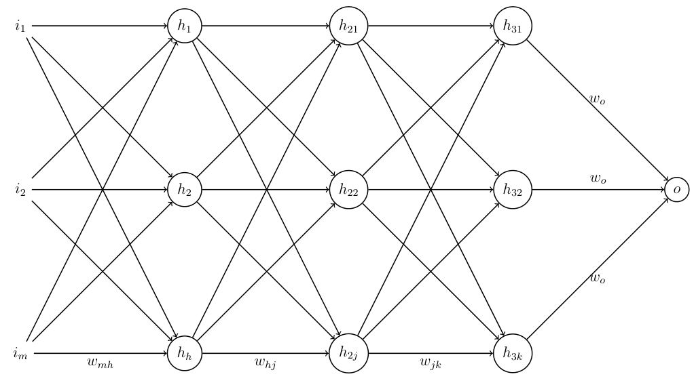

# CCeptron

A multi-layer perceptron written in C.

The entire code is a **single C file**. The program admits CSV files as data and all the important hyperparameters as arguments from the command line. In order to compile and use the program:

```{language=bash}
git clone 'https://github.com/DarkAdin/CCeptron.git'
cd CCeptron
make
```
This will compile the program with the appropiate flags. Set
```{language=bash}
DEBUG = 1
```
in the *Makefile* if you wish to use it with a debugger.

Then, use it as follows:
```{language=bash}
./CCeptron file.csv input_size hidden_size hidden_size2 output_size epochs learning_rate annealing_rate saved_model
```

That will train the network on the data and save all weights and biases in a file. If the file already exists, the program skips the training part and directly predicts on the data.



The network comes with three hidden layers and one output layer by default. The three hidden layers use *leaky RELU* as the activation function and the output layer uses *sigmoid*.

In the image above, we can see an idea of such network:

* *m* parameters
* *h* hidden neurons in the first hidden layer
* *j* hidden neurons in the second hidden layer
* *k* hidden neurons in the third hidden layer
* One output neuron in the output layer

Each neuron has its own bias. After applying weights and bias in each neuron, the activation function produces its output, which will be fed into the next layer until the output layer is reached. The output of the output layer will be faced against the real value present in the training data, and with that value the loss function will be calculated. With the loss function (its derivative, to be more specific) the network computes all gradients, which are useful in the *back propagation* process when we will update all weights and biases before the next *forward propagation* cycle.

The addition and modification of any aspect of the network should be easy enough, whether you want to add or remove hidden layers, and/or different activation functions.

Once all training epochs have passed, the network tests itself on the training data. This, of course, should be done on a separate testing dataset.

The random number generator is seeded with the current time and the current process ID.

In every iteration, CCeptron trains on a randomly picked row of the training data set, and does the same in every iteration of the testing stage, so it does not need to shuffle the training data and/or the testing data.

The learning rate is updated every epoch by the annealing rate. It uses gradient descent as the training scheme.

Now the back propagation function outputs the current error, which is shown every 50 epochs.

## Example of valid data

The following example row comes from the *iris* dataset (encoded accordingly):

```
0.645569,0.795454,0.202898,0.08,1.00
```

Which consists of

```
sepal_length,sepal_width,petal_length,petal_width,class
```

If we wanted to train on this data, we should specify 4 as the input size and 1 as the output size (4 parameters and 1 class).

The class is encoded in the form of a number as well. If we have 3 different species in the *iris* dataset, an example of encoding them could be *0.0*, *0.5* and *1.0*. The maximum number of decimals in a data point should be 6.

Another way of encoding classes could be
```
0.645569,0.795454,0.202898,0.08,1,0,0
```
Where the last three digits signify the class. Thus, if we have three classes, they could be encoded as
```
...,1,0,0 # First class
...,0,1,0 # Second class
...,0,0,1 # Third class
```

Remember to normalize every column by its maximum value so everything falls between the 0-1 range.

## Inspirations

CCeptron is a minimalistic approach to a simple neural network concept, [the perceptron](https://en.wikipedia.org/wiki/Perceptron). As such, it is not a fully capable neural network. But it should be easily modifiable to suit general needs and make predictions on small-to-medium complexity data. Check out these amazing machine learning projects in C which heavily inspired CCeptron:

* [tinn](https://github.com/glouw/tinn): tiny neural network written in C with one hidden layer.
* [darknet](https://github.com/pjreddie/darknet): one of the biggest machine learning projects in C, works with CUDA and heavily influenced the Computer Vision field, capable of almost anything.
* [genann](https://github.com/codeplea/genann)
* [kann](https://github.com/attractivechaos/kann): very complete project for constructing small to medium neural networks.

## TO-DO

These things will be added in the future:

* ~~Save all weights and biases of the network to make future predictions~~
* Set a way to read a separate testing set in order to do the testing
* Multi-threading
